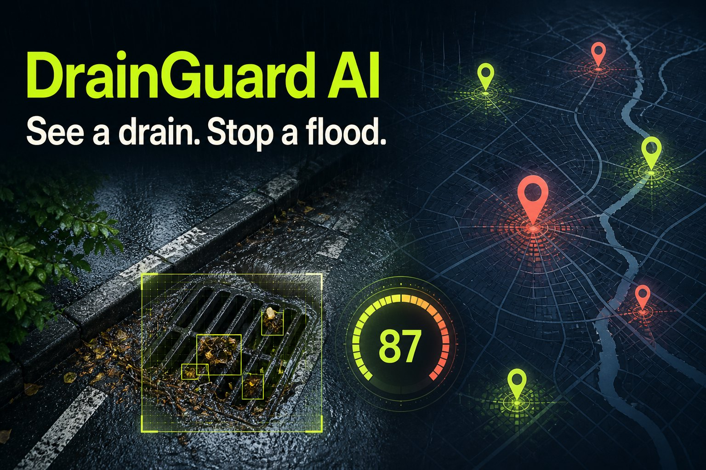
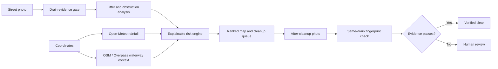

# DrainGuard AI

> Stop street waste before the next storm moves it downstream.

DrainGuard AI is an AI-assisted environmental monitoring and cleanup-prioritization prototype. A field worker uploads a street photo, the app checks the visual evidence, combines blockage and litter signals with location-specific rainfall and mapped waterway context, and ranks the report for action. A second photo is required to verify cleanup.

[Live demo](https://drainguard-ai-earth.vercel.app) · [Devpost submission notes](docs/DEVPOST.md) · [Architecture and evaluation](docs/ARCHITECTURE.md)



Built for the **GatewayGS & AEI Initiative: AI 4 Earth Hackathon**.

## The problem

Municipal crews cannot inspect every drain before heavy rainfall. Cleanup is often reactive and driven by complaints rather than consistent evidence. Visible litter, organic debris, and rainfall together can make a blocked inlet more urgent, yet teams rarely have one ranked, explainable queue.

DrainGuard answers a practical question:

> Which reported drain should a cleanup team inspect first?

It is a prioritization aid, not a flood predictor or replacement for engineering assessment.

## What it does

- analyzes an uploaded drain photo directly in the browser;
- checks for drain-like structural and scene evidence before trusting a result;
- uses COCO-SSD only for visible litter objects, not as a drain model;
- fetches rainfall for each report's latitude and longitude from Open-Meteo;
- calculates a transparent priority score;
- calculates a separate environmental decision-support estimate with explicit evidence coverage;
- looks up nearby mapped rivers, streams, canals, and water bodies through OpenStreetMap / Overpass;
- explains every factor and contribution behind the result;
- explores dry, moderate, and heavy controlled rainfall scenarios without presenting them as forecasts;
- places reports on an OpenStreetMap map and sorts them into a cleanup queue;
- stores compressed before/after evidence on the inspection device;
- requires a same-drain scene match and meaningful improvement before closing a report;
- routes non-drain, low-confidence, unchanged, or mismatched evidence to human review.

## Explainable priority model

```text
priority = 0.55 × blockage + 0.30 × rainfall index + 0.15 × litter
```

The weights are intentionally visible in the product. They are pilot policy values, not scientifically validated flood probabilities.

The environmental decision-support estimate is also centrally configured:

```text
environmental risk = 0.40 × blockage
                   + 0.30 × rainfall index
                   + 0.20 × litter
                   + 0.10 × mapped waterway proximity
```

If waterway context cannot be retrieved, DrainGuard does not invent a value. It normalizes across available evidence, lowers evidence coverage, and exposes the limitation.

## AI and computer vision

DrainGuard uses a layered evidence pipeline:

1. **Drain evidence gate** — image structure, edge geometry, natural-scene color, and debris-tone signals estimate whether the photo contains credible drain evidence.
2. **Litter detection** — client-side COCO-SSD identifies visible objects such as bottles and cups.
3. **Obstruction estimation** — image texture, dark regions, earthy debris tones, and detected litter contribute to the visible obstruction score.
4. **Same-drain verification** — normalized low-resolution scene fingerprints compare before/after composition. A pair needs at least a 68% scene match.
5. **Human review** — uncertain evidence never automatically closes a cleanup report.

This architecture is designed to be transparent about the current prototype: the drain gate is an engineered domain layer, while COCO-SSD is a generic object detector used only for litter.

## Verification rules

A cleanup is marked **Verified clear** only when all conditions pass:

- same-drain scene match is at least 68%;
- drain-presence confidence is at least 60%;
- remaining obstruction is at most 48%;
- remaining litter signal is at most 48%;
- obstruction falls by at least 15 points.

Otherwise, the report enters the visible human-review queue.

## Architecture



## Technology

- Next.js 16 and React 19
- TypeScript
- TensorFlow.js with COCO-SSD
- Leaflet and OpenStreetMap
- Open-Meteo weather and geocoding APIs
- OpenStreetMap Overpass environmental-context lookup
- Nominatim address search
- Vercel deployment
- Node.js test runner and ESLint

## Run locally

Requirements: Node.js 22.13 or newer.

```bash
git clone https://github.com/bhavyakeerthi3/drainguard-ai.git
cd drainguard-ai
npm install
npm run dev
```

Open <http://localhost:3000>.

No API keys are required for the current prototype.

## Quality checks

```bash
npm run lint
npm run typecheck
npm run test:scoring
npm test
npm audit
```

The automated suite verifies the production build, risk formula, live map wiring, cleanup workflow, safeguards, and 12 documented decision-regression cases.

## Current evaluation

The prototype has 12 deterministic workflow checks covering:

- three blocked-drain controls;
- three clear-drain controls;
- two valid same-drain cleanup pairs;
- one unchanged after-cleanup pair;
- two different-scene pairs;
- one non-drain input.

These checks validate workflow decisions, not real-world model accuracy. A field-labelled Bengaluru dataset with precision, recall, and false-positive reporting is the next validation milestone.

## Privacy and persistence

Photo analysis runs client-side. Reports and compressed evidence currently persist in browser storage on the inspection device. A shared authenticated municipal backend is planned for multi-user deployments.

## Project structure

```text
app/                  Next.js interface, map, panels, and analysis workflow
lib/scoring/          centralized priority, environmental, and scenario scoring
lib/environment.ts    failure-tolerant waterway lookup
lib/decisions.js      auditable verification thresholds
public/               demo and social-preview assets
tests/                build and decision-regression tests
docs/                 architecture and submission documentation
```

## Responsible use

DrainGuard prioritizes visual inspections. Environmental scores are decision-support estimates, not hydrological predictions or measurements of pollution volume. Scores depend on image quality, rainfall inputs, and available mapped context. Emergency response, hydraulic modelling, and engineering decisions must remain with qualified authorities.

## Data and service attribution

- Weather: [Open-Meteo](https://open-meteo.com/)
- Maps: [OpenStreetMap](https://www.openstreetmap.org/) and [Leaflet](https://leafletjs.com/)
- Object model: [TensorFlow.js COCO-SSD](https://github.com/tensorflow/tfjs-models/tree/master/coco-ssd)
- Demonstration drain image: [Michigan EGLE](https://www.michigan.gov/egle/about/organization/water-resources/stormwater)

## License

Released under the [MIT License](LICENSE).
