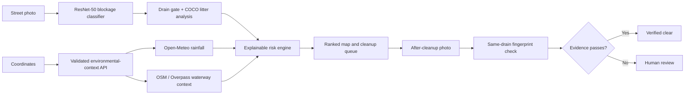

# DrainGuard AI

> Stop street waste before the next storm moves it downstream.

[](https://github.com/bhavyakeerthi3/drainguard-ai/actions/workflows/ci.yml)
[](https://drainguard-ai-earth.vercel.app)
[](LICENSE)

DrainGuard AI is an AI-assisted environmental monitoring and cleanup-prioritization prototype. A field worker uploads a street photo, the app checks the visual evidence, combines blockage and litter signals with location-specific rainfall and mapped waterway context, and ranks the report for action. A second photo is required to verify cleanup.

[Live demo](https://drainguard-ai-earth.vercel.app) · [Devpost submission notes](docs/DEVPOST.md) · [Repository handoff](docs/REPOSITORY_GUIDE.md) · [Architecture and evaluation](docs/ARCHITECTURE.md)


Built for the **GatewayGS & AEI Initiative: AI 4 Earth Hackathon**.

## Repository status

This repository contains the complete public prototype: the Next.js product interface, browser vision pipeline, environmental context API, scoring and verification policy, benchmark fixtures, model artifact metadata, tests, CI workflow, and submission documentation. The deployed app is a single-device pilot; it does not claim to be a production municipal data platform.

The product is intentionally framed as **inspection prioritization and cleanup verification**, not flood prediction. Every result exposes its evidence, confidence, data coverage, recommended action, and limitation.

## The problem

Municipal crews cannot inspect every drain before heavy rainfall. Cleanup is often reactive and driven by complaints rather than consistent evidence. Visible litter, organic debris, and rainfall together can make a blocked inlet more urgent, yet teams rarely have one ranked, explainable queue.

DrainGuard answers a practical question:

> Which reported drain should a cleanup team inspect first?

It is a prioritization aid, not a flood predictor or replacement for engineering assessment.

## What it does

- analyzes an uploaded drain photo directly in the browser;
- runs a research-backed, drain-specific ResNet-50 classifier on labelled clear/blocked imagery;
- checks for drain-like structural and scene evidence before trusting a result;
- uses COCO-SSD only for visible litter objects, not as a drain model;
- fetches rainfall for each report's latitude and longitude through a validated server endpoint backed by Open-Meteo;
- calculates a transparent priority score;
- calculates a separate environmental decision-support estimate with explicit evidence coverage;
- looks up nearby mapped rivers, streams, canals, and water bodies through OpenStreetMap / Overpass;
- explains every factor and contribution behind the result;
- explores dry, moderate, and heavy controlled rainfall scenarios without presenting them as forecasts;
- places reports on an OpenStreetMap map and sorts them into a cleanup queue;
- stores compressed before/after evidence on the inspection device;
- requires a same-drain scene match and meaningful improvement before closing a report;
- routes non-drain, low-confidence, unchanged, or mismatched evidence to human review.

## Complete product workflow

The public interface is organized into three operational stages:

| Stage | What the user does | What DrainGuard returns |
| --- | --- | --- |
| **Inspect** | Upload a drain photo or reset the controlled sample | Blockage, drain-presence, litter, confidence, rainfall, waterway context, and explainable priority |
| **Prioritize** | Search a location, review the map, and inspect the ranked queue | Location-aware reports, environmental concern, reason for ranking, persistence state, and human-review actions |
| **Verify** | Upload an after-cleanup photo and compare it side-by-side or with the slider | Same-drain match, before/after deltas, pass/fail checks, verified-clear status or human review |

Additional product surfaces include:

- **Priority Shock:** controlled rainfall changes show why the same drains can change order without changing the photos.
- **Action Planner:** a transparent crew/capacity allocator shows which reports fit today and which remain in the next wave.
- **Controlled scenarios:** dry, moderate, and heavy rainfall examples are labelled as sample data, never as a forecast.
- **Field brief:** the current evidence and decision can be copied as a concise operational handoff.
- **Pitch Mode:** a compact story-first view hides supporting panels for a short product presentation.
- **Validation and trust panels:** the UI states what the prototype proves, what it does not prove, and when a person must decide.
- **Evaluation surfaces:** the held-out model audit, confusion matrix, and twelve workflow-policy checks are visible in the app.

## Decision policy in one view

```text
priority = 0.55 × blockage + 0.30 × rainfall index + 0.15 × litter
```

The operational bands are `0–59 Monitor`, `60–79 Inspect today`, and `80–100 Dispatch now`. A high score never bypasses the drain-evidence gate.

Cleanup closes only when all of these pass:

```text
same-drain scene match >= 68%
drain confidence      >= 60%
remaining blockage    <= 48%
remaining litter      <= 48%
blockage reduction    >= 15 points
```

Any failed or uncertain check remains open for human review.

## Explainable priority model

```text
priority = 0.55 × blockage + 0.30 × rainfall index + 0.15 × litter
```

The weights are intentionally visible in the product. They are pilot policy values, not scientifically validated flood probabilities.

The environmental decision-support estimate is also centrally configured:

```text
environmental risk = 0.40 × blockage
                   + 0.30 × rainfall index
                   + 0.20 × litter
                   + 0.10 × mapped waterway proximity
```

If rainfall or waterway context cannot be retrieved, DrainGuard does not invent a value. It normalizes across available evidence, lowers evidence coverage, and exposes the limitation.

## AI and computer vision

DrainGuard uses a layered evidence pipeline:

1. **Drain-specific blockage classifier** — the published University of Reading ResNet-50 blockage classifier estimates clear versus blocked evidence entirely in the browser through ONNX Runtime Web. Its 24 MB INT8 export keeps photos on-device.
2. **Drain evidence gate** — image structure, edge geometry, natural-scene color, and debris-tone signals reject uncertain or unrelated photos.
3. **Litter detection** — client-side COCO-SSD identifies visible objects such as bottles and cups; it is not presented as a drain model.
4. **Same-drain verification** — normalized low-resolution scene fingerprints compare before/after composition. A pair needs at least a 68% scene match.
5. **Human review** — uncertain evidence never automatically closes a cleanup report.

The threshold is fixed on seven calibration cameras and the local audit uses the four cameras held out by the source paper. The engineered visual score remains an offline fallback if the ONNX runtime cannot load.

## Verification rules

A cleanup is marked **Verified clear** only when all conditions pass:

- same-drain scene match is at least 68%;
- drain-presence confidence is at least 60%;
- remaining obstruction is at most 48%;
- remaining litter signal is at most 48%;
- obstruction falls by at least 15 points.

Otherwise, the report enters the visible human-review queue.

## Architecture



## Technology

- Next.js 16 and React 19
- Next.js route handler / Vercel Function for resilient environmental lookups
- TypeScript
- TensorFlow.js with COCO-SSD
- ONNX Runtime Web with a drain-specific, INT8-quantized ResNet-50 classifier
- PyTorch and ONNX Runtime for reproducible export and camera-separated evaluation
- Leaflet and OpenStreetMap
- Open-Meteo weather and geocoding APIs
- OpenStreetMap Overpass environmental-context lookup
- Nominatim address search
- Vercel deployment
- Node.js test runner and ESLint

## Run locally

Requirements: Node.js 22.13 or newer.

```bash
git clone https://github.com/bhavyakeerthi3/drainguard-ai.git
cd drainguard-ai
npm install
npm run dev
```

Open <http://localhost:3000>.

No API keys are required for the current prototype.

## Deployment

The production app is deployed from `main` on Vercel:

- Live URL: <https://drainguard-ai-earth.vercel.app>
- GitHub: <https://github.com/bhavyakeerthi3/drainguard-ai>
- API route: `/api/environmental-context?latitude=<lat>&longitude=<lon>`

The API validates coordinate ranges, fetches rainfall and mapped-waterway context in parallel, uses bounded timeouts, and returns explicit unavailable states rather than fabricated values. Successful responses are edge-cached for 15 minutes.

## Quality checks

```bash
npm run lint
npm run typecheck
npm run test:scoring
npm run evaluate:baseline
npm run export:vision
npm test
npm audit
```

The automated suite verifies the production build, risk formula, live map wiring, cleanup workflow, safeguards, benchmark split integrity, and 12 documented decision-regression cases.

GitHub Actions runs the same quality gates on pushes and pull requests to `main`: lint, TypeScript, scoring tests, the production build/test suite, and a high-severity production dependency audit. See [CONTRIBUTING.md](CONTRIBUTING.md) for the expected development loop.

## Current evaluation

The browser classifier achieved **92.5% accuracy and balanced accuracy** on a reproducible 40-image balanced audit from the four cameras held out by the source research: 20/20 blocked images detected and 17/20 clear images correctly rejected.

| Metric | Held-out result |
| --- | ---: |
| Accuracy / balanced accuracy | 92.5% |
| Blocked recall | 100% |
| Clear specificity | 85% |
| Precision | 87% |
| F1 | 0.93 |
| Accuracy 95% Wilson interval | 80.1%–97.4% |

The threshold was selected on 28 images from seven different calibration cameras. Calibration and audit cameras do not overlap. The source paper reports 88% average balanced accuracy for its classifier on its full evaluation; DrainGuard's smaller audit is provided to verify the exact quantized browser artifact, not to replace that study.

The proxy dataset contains UK trash screens rather than Bengaluru street inlets, so these numbers are not claimed as Bengaluru field accuracy. The app separately retains 12 deterministic workflow checks for ranking, wrong-scene rejection, and human-review routing. See [the full protocol](docs/EVALUATION.md) and [model card](docs/MODEL_CARD.md).

## Privacy and persistence

Photo analysis runs client-side. Reports and compressed evidence currently persist in browser storage on the inspection device. A shared authenticated municipal backend is planned for multi-user deployments.

## Known limitations

- The held-out model audit uses UK trash-screen imagery, not Bengaluru street drains.
- A 40-image audit is an integration check, not a field deployment guarantee.
- Image evidence estimates visible obstruction; it does not measure hydraulic capacity or pollution volume.
- Browser storage is device-local. Reports are not shared between users or devices.
- Map, geocoding, weather, and model-library providers can be unavailable; the UI exposes the gap.
- Real municipal use still needs field validation, authentication, retention controls, role-based access, and an audit log.

These limitations are part of the product contract and are covered in the [model card](docs/MODEL_CARD.md), [evaluation protocol](docs/EVALUATION.md), and [architecture notes](docs/ARCHITECTURE.md).

## Project structure

```text
app/                  Next.js interface, map, panels, and analysis workflow
lib/scoring/          centralized priority, environmental, and scenario scoring
lib/environment.ts    parallel, failure-tolerant weather and waterway lookups
lib/decisions.js      auditable verification thresholds
lib/vision.js         shared browser and baseline visual features
public/               demo and social-preview assets
evaluation/           labelled audit fixtures, manifests, and frozen results
scripts/              reproducible data preparation, export, and evaluation
tests/                build and decision-regression tests
docs/                 architecture and submission documentation
```

## Responsible use

DrainGuard prioritizes visual inspections. Environmental scores are decision-support estimates, not hydrological predictions or measurements of pollution volume. Scores depend on image quality, rainfall inputs, and available mapped context. Emergency response, hydraulic modelling, and engineering decisions must remain with qualified authorities.

## Data and service attribution

- Weather: [Open-Meteo](https://open-meteo.com/)
- Maps: [OpenStreetMap](https://www.openstreetmap.org/) and [Leaflet](https://leafletjs.com/)
- Object model: [TensorFlow.js COCO-SSD](https://github.com/tensorflow/tfjs-models/tree/master/coco-ssd)
- Blockage dataset and classifier weights: [University of Reading Research Data Archive](https://doi.org/10.17864/1947.000498)
- Source research: [Vandaele, Dance, and Ojha (2024)](https://doi.org/10.2166/hydro.2024.013)
- Demonstration drain image: [Michigan EGLE](https://www.michigan.gov/egle/about/organization/water-resources/stormwater)

## License

DrainGuard application code is released under the [MIT License](LICENSE). The research-derived blockage model, upstream reference files, and benchmark images retain their source licences: CC BY 4.0 for the dataset/code/weights and Open Government Licence v3.0 for the Crown Copyright images. See [the model card](docs/MODEL_CARD.md) for attribution.
