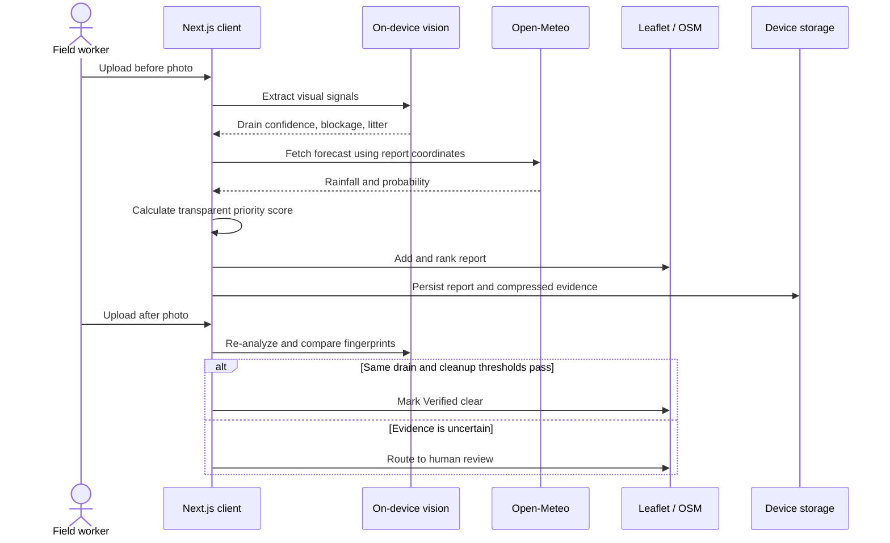

# DrainGuard architecture

## System goal

DrainGuard converts visual drain inspections into an explainable cleanup queue. It deliberately separates three questions:

1. Is this credible drain evidence?
2. How urgent is the cleanup under local rainfall?
3. Does the after photo prove that the same drain was cleared?

## End-to-end flow



## Main modules

| Module | Location | Responsibility |
| --- | --- | --- |
| Inspection workflow | `app/page.tsx` | Upload, image preparation, analysis, risk calculation, persistence, review and verification UI |
| Priority map | `app/DrainMap.tsx` | Leaflet map, markers, report selection and map movement |
| Decision policy | `lib/decisions.js` | Auditable drain, priority and cleanup thresholds |
| Regression suite | `tests/rendered-html.test.mjs` | Production build, feature wiring and 12 decision cases |

## Vision pipeline

### 1. Image preparation

Uploaded images are decoded in the browser, resized to a maximum dimension of 960 pixels, and compressed to JPEG for evidence storage. The original file is not uploaded to a DrainGuard server in the current prototype.

### 2. Drain evidence gate

The app samples a 96 × 96 canvas and derives:

- horizontal and vertical edge density;
- grate-like structural evidence;
- dark and earth-toned surface evidence;
- natural-scene colour variation;
- penalties for large unrelated COCO object classes.

A result below 60% drain confidence enters `Needs review`, even if its calculated risk is high.

### 3. Litter and obstruction

COCO-SSD runs through TensorFlow.js in the client and provides visible object detections. Only a restricted set of litter-relevant classes affects the litter signal. Texture and debris-tone heuristics provide a fallback if the model resource is unavailable.

COCO-SSD is not represented as a drain-specific model.

### 4. Scene fingerprint

Each image is reduced to a 12 × 8 luminance fingerprint. Values are normalized by image mean and deviation, reducing sensitivity to global brightness changes. Cosine correlation becomes a 0–100 scene-match score.

An after photo needs a scene match of at least 68% before it can close a report.

## Risk engine

```text
rainfall index = clamp((rainfall mm / 64) × 100)
priority       = round(0.55 × blockage
                     + 0.30 × rainfall index
                     + 0.15 × litter)
```

| Score | Operational action |
| ---: | --- |
| 80–100 | Dispatch now |
| 60–79 | Inspect today |
| 0–59 | Monitor |

Low risk does not automatically mean `Verified clear`; that status requires after-cleanup evidence.

## Cleanup verification policy

The decision policy is intentionally isolated in `lib/decisions.js`. A report closes automatically only when:

```text
sameDrain = true
drainConfidence >= 60
blockage <= 48
litter <= 48
reduction >= 15
```

Every failed condition retains the report for human review.

## External services

| Service | Data sent | Purpose | Fallback |
| --- | --- | --- | --- |
| Open-Meteo forecast | Latitude and longitude | Location-specific rainfall | 18 mm pilot fallback |
| Nominatim / Open-Meteo geocoding | User-entered location text | Convert place to coordinates | Ask for a more specific location |
| OpenStreetMap tiles | Map viewport | Display inspection markers | Queue remains usable |
| jsDelivr | Model-library request | Load TensorFlow.js and COCO-SSD | Visual-feature fallback |

## Persistence

The prototype stores a versioned report payload in browser `localStorage`:

```text
sites: MapSite[]
evidence: Record<siteId, {
  beforeImage,
  beforeAnalysis,
  afterImage?,
  verification?,
  updatedAt
}>
```

This is suitable for a single-device pilot and demo. A municipal deployment requires authenticated, shared storage with role-based access, retention controls, and an audit log.

## Responsible boundaries

- DrainGuard prioritizes inspections; it does not predict flood occurrence.
- Visual obstruction is not hydraulic capacity.
- Forecast data and image quality affect the priority score.
- Low-confidence and mismatched evidence must remain reviewable by a person.
- The current regression suite validates workflow policy, not field accuracy.

## Production roadmap

1. Provision shared Postgres and object storage for reports and images.
2. Add authentication and ward-level access control.
3. Collect and independently label a Bengaluru drain dataset.
4. Train or fine-tune a drain-specific detector for grates, silt, vegetation and litter.
5. Report precision, recall, calibration and subgroup performance.
6. Add immutable crew-action and verification audit events.
